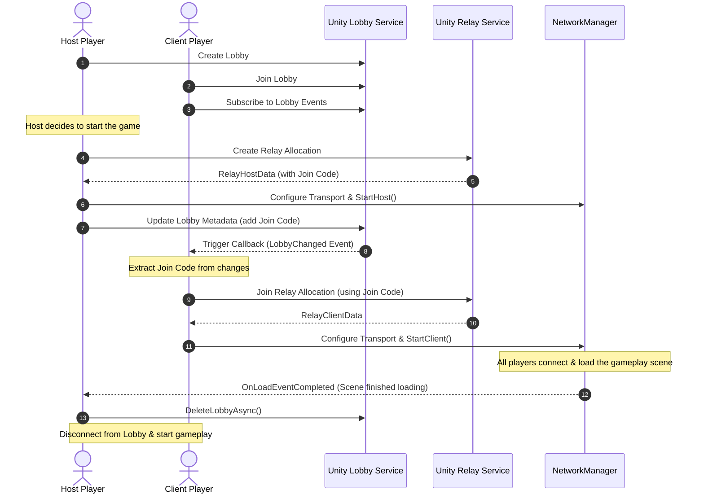

# Lobby-Relay Integration & Transition Plan

This document outlines the implementation plan and full code modifications to integrate the **Lobby** and **Relay** services. This allows the Lobby Host to create a Relay session, share the credentials reactively via Lobby Events, and clean up the Lobby after all players successfully transition into the gameplay scene.

---

## 1. Sequence Diagram: Handshake and Cleanup Flow



---

## 2. Code Modifications

To support this integration, we need to add Lobby Event Subscriptions and Lobby Metadata updates.

### A. Updating `ILobbyService.cs` and `UnityLobbyService.cs`

#### [ILobbyService.cs](file:///Users/lehoangan/Documents/GitHub/AttoTheSheep/Assets/lehoangan/Features/Lobby/Domain/Interfaces/ILobbyService.cs)
Add the event subscription method signature:
```csharp
using System.Collections.Generic;
using System.Threading.Tasks;
using Unity.Services.Lobbies;
using Unity.Services.Lobbies.Models;

public interface ILobbyService
{
    // ... existing signatures ...
    Task<Lobby> CreateLobbyAsync(string lobbyName, int maxPlayers, bool isPrivate, Player player);
    Task<QueryResponse> QueryLobbiesAsync(QueryLobbiesOptions options);
    Task<Lobby> JoinLobbyByIdAsync(string lobbyId, JoinLobbyByIdOptions options);
    Task<Lobby> JoinLobbyByCodeAsync(string lobbyCode, JoinLobbyByCodeOptions options);
    Task<Lobby> QuickJoinLobbyAsync(QuickJoinLobbyOptions options);
    Task LeaveLobbyAsync(string lobbyId, string playerId);
    Task DeleteLobbyAsync(string lobbyId);
    Task SendHeartbeatPingAsync(string lobbyId);
    Task<Lobby> UpdateLobbyAsync(string lobbyId, UpdateLobbyOptions options);
    
    // Add this subscription signature:
    Task<ILobbyEvents> SubscribeToLobbyEventsAsync(string lobbyId, LobbyEventCallbacks callbacks);
}
```

#### [UnityLobbyService.cs](file:///Users/lehoangan/Documents/GitHub/AttoTheSheep/Assets/lehoangan/Features/Lobby/Data/UnityLobbyService.cs)
Implement the subscription method using the Unity Lobby SDK:
```csharp
using System.Collections.Generic;
using System.Threading.Tasks;
using Unity.Services.Lobbies;
using Unity.Services.Lobbies.Models;

public class UnityLobbyService : ILobbyService
{
    // ... existing implementations ...

    public async Task<ILobbyEvents> SubscribeToLobbyEventsAsync(string lobbyId, LobbyEventCallbacks callbacks)
    {
        return await LobbyService.Instance.SubscribeToLobbyEventsAsync(lobbyId, callbacks);
    }
}
```

---

### B. New Domain Use Cases (`Domain/UseCases/`)

#### [UpdateLobbyUseCase.cs](file:///Users/lehoangan/Documents/GitHub/AttoTheSheep/Assets/lehoangan/Features/Lobby/Domain/UseCases/UpdateLobbyUseCase.cs)
```csharp
using System.Threading.Tasks;
using Unity.Services.Lobbies;
using Unity.Services.Lobbies.Models;

public class UpdateLobbyUseCase
{
    private readonly ILobbyService _lobbyService;

    public UpdateLobbyUseCase(ILobbyService lobbyService)
    {
        _lobbyService = lobbyService;
    }

    public async Task<Lobby> ExecuteAsync(string lobbyId, UpdateLobbyOptions options)
    {
        return await _lobbyService.UpdateLobbyAsync(lobbyId, options);
    }
}
```

#### [SubscribeLobbyEventsUseCase.cs](file:///Users/lehoangan/Documents/GitHub/AttoTheSheep/Assets/lehoangan/Features/Lobby/Domain/UseCases/SubscribeLobbyEventsUseCase.cs)
```csharp
using System.Threading.Tasks;
using Unity.Services.Lobbies;

public class SubscribeLobbyEventsUseCase
{
    private readonly ILobbyService _lobbyService;

    public SubscribeLobbyEventsUseCase(ILobbyService lobbyService)
    {
        _lobbyService = lobbyService;
    }

    public async Task<ILobbyEvents> ExecuteAsync(string lobbyId, LobbyEventCallbacks callbacks)
    {
        return await _lobbyService.SubscribeToLobbyEventsAsync(lobbyId, callbacks);
    }
}
```

---

### C. Integrating inside the Presenter (`LobbyPresenter.cs`)

We need to add dependencies for the two new Use Cases to `LobbyPresenter` and wire up the subscription handlers.

#### [LobbyPresenter.cs Changes](file:///Users/lehoangan/Documents/GitHub/AttoTheSheep/Assets/lehoangan/Features/Lobby/Presentation/LobbyPresenter.cs)
```csharp
using System;
using System.Collections.Generic;
using System.Threading.Tasks;
using Unity.Services.Authentication;
using Unity.Services.Lobbies;
using Unity.Services.Lobbies.Models;
using UnityEngine;

public class LobbyPresenter
{
    // ... existing fields ...
    private readonly UpdateLobbyUseCase _updateLobbyUseCase;
    private readonly SubscribeLobbyEventsUseCase _subscribeLobbyEventsUseCase;
    
    private ILobbyEvents _lobbyEvents;

    public event Action<string> OnRelayJoinCodeReceived; // Notifies UI/Manager to start joining Relay

    public LobbyPresenter(
        CreateLobbyUseCase createLobbyUseCase,
        JoinLobbyUseCase joinLobbyUseCase,
        LeaveLobbyUseCase leaveLobbyUseCase,
        GetLobbiesUseCase getLobbiesUseCase,
        HeartbeatLobbyUseCase heartbeatLobbyUseCase,
        UpdateLobbyUseCase updateLobbyUseCase,                // Added
        SubscribeLobbyEventsUseCase subscribeLobbyEventsUseCase // Added
    )
    {
        // ... assign standard Use Cases ...
        _updateLobbyUseCase = updateLobbyUseCase;
        _subscribeLobbyEventsUseCase = subscribeLobbyEventsUseCase;
    }

    // Subscribe to events when joining or creating a lobby
    public async Task SubscribeToCurrentLobby()
    {
        if (JoinedLobby == null) return;

        try
        {
            var callbacks = new LobbyEventCallbacks();
            callbacks.LobbyChanged += OnLobbyChanged;
            callbacks.KickedFromLobby += OnKickedFromLobby;

            _lobbyEvents = await _subscribeLobbyEventsUseCase.ExecuteAsync(JoinedLobby.Id, callbacks);
        }
        catch (Exception e)
        {
            OnErrorOccurred?.Invoke($"Lobby event subscription failed: {e.Message}");
        }
    }

    // Shares the Relay Join Code with other lobby members
    public async Task ShareRelayJoinCode(string joinCode)
    {
        if (JoinedLobby == null) return;

        try
        {
            var options = new UpdateLobbyOptions
            {
                Data = new Dictionary<string, DataObject>
                {
                    { "RelayJoinCode", new DataObject(DataObject.VisibilityOptions.Member, joinCode) }
                }
            };

            JoinedLobby = await _updateLobbyUseCase.ExecuteAsync(JoinedLobby.Id, options);
            OnJoinedLobbyUpdated?.Invoke(JoinedLobby);
        }
        catch (Exception e)
        {
            OnErrorOccurred?.Invoke($"Failed to share join code: {e.Message}");
            throw;
        }
    }

    private void OnLobbyChanged(ILobbyChanges changes)
    {
        if (JoinedLobby == null) return;

        // Apply incremental changes to our local state in-place
        changes.ApplyToLobby(JoinedLobby);
        OnJoinedLobbyUpdated?.Invoke(JoinedLobby);

        // Check if the host published the Relay Join Code
        if (changes.Data.Changed && JoinedLobby.Data.TryGetValue("RelayJoinCode", out var dataObject))
        {
            string code = dataObject.Value;
            if (!string.IsNullOrEmpty(code))
            {
                OnRelayJoinCodeReceived?.Invoke(code);
            }
        }
    }

    private void OnKickedFromLobby()
    {
        JoinedLobby = null;
        OnJoinedLobbyUpdated?.Invoke(null);
    }

    public async Task UnsubscribeLobbyEvents()
    {
        if (_lobbyEvents != null)
        {
            await _lobbyEvents.UnsubscribeAsync();
            _lobbyEvents = null;
        }
    }
}
```

---

## 3. Coordinating Transition inside `LobbyManager.cs`

`LobbyManager` will handle scene loading verification and ensure clean disposal of the Lobby service metadata *after* transition completes.

#### [LobbyManager.cs Changes](file:///Users/lehoangan/Documents/GitHub/AttoTheSheep/Assets/lehoangan/Features/Lobby/Presentation/LobbyManager.cs)
```csharp
using UnityEngine;
using Unity.Netcode;
using System;

public class LobbyManager : MonoBehaviour
{
    // ... existing properties and Awake DI setups ...

    private void Awake()
    {
        // Dependency Injection Setup (update with new use cases)
        ILobbyService lobbyService = new UnityLobbyService();
        Presenter = new LobbyPresenter(
            new CreateLobbyUseCase(lobbyService),
            new JoinLobbyUseCase(lobbyService),
            new LeaveLobbyUseCase(lobbyService),
            new GetLobbiesUseCase(lobbyService),
            new HeartbeatLobbyUseCase(lobbyService),
            new UpdateLobbyUseCase(lobbyService),               // Added
            new SubscribeLobbyEventsUseCase(lobbyService)      // Added
        );

        Presenter.OnRelayJoinCodeReceived += OnRelayJoinCodeReceived;
    }

    private void Start()
    {
        // Listen to Netcode Scene transitions
        if (NetworkManager.Singleton != null && NetworkManager.Singleton.SceneManager != null)
        {
            NetworkManager.Singleton.SceneManager.OnLoadEventCompleted += OnSceneLoadCompleted;
        }
    }

    // Triggered on Clients when the Host publishes a Relay Join Code
    private async void OnRelayJoinCodeReceived(string joinCode)
    {
        if (NetworkManager.Singleton.IsServer || NetworkManager.Singleton.IsHost) return;

        Debug.Log($"[Client] Received Relay Join Code: {joinCode}. Connecting to game session...");
        
        // Connect Client via Relay
        await RelayManager.Instance.Presenter.JoinRelay(joinCode);
    }

    // Host Action: Triggered when "Start Game" button is clicked
    public async void HostStartGame()
    {
        if (!Presenter.IsHost) return;

        try
        {
            // 1. Create Relay Allocation using standard Relay Use Case
            Debug.Log("[Host] Allocating Relay session...");
            await RelayManager.Instance.Presenter.CreateRelay(Presenter.JoinedLobby.MaxPlayers);
            string joinCode = RelayManager.Instance.Presenter.HostData.JoinCode;

            // 2. Share Relay Join Code with Lobby
            Debug.Log($"[Host] Relay created. Sharing Join Code {joinCode} with Lobby members...");
            await Presenter.ShareRelayJoinCode(joinCode);

            // 3. Initiate Unity Netcode Scene loading
            Debug.Log("[Host] Starting game scene load...");
            NetworkManager.Singleton.SceneManager.LoadScene("GamePlayScene", UnityEngine.SceneManagement.LoadSceneMode.Single);
        }
        catch (Exception e)
        {
            Debug.LogError($"[Host] Failed to transition to game: {e.Message}");
        }
    }

    // Triggered on Host & Clients when the Gameplay scene has finished loading
    private async void OnSceneLoadCompleted(string sceneName, UnityEngine.SceneManagement.LoadSceneMode loadMode, List<ulong> clientsCompleted, List<ulong> clientsTimedOut)
    {
        if (sceneName != "GamePlayScene") return;

        // Clean up event subscription
        await Presenter.UnsubscribeLobbyEvents();

        if (NetworkManager.Singleton.IsServer)
        {
            Debug.Log("[Host] Scene load completed for all clients. Terminating Lobby cloud session...");
            // Delete the lobby from Unity Services so it no longer appears in searches
            await Presenter.LeaveLobby(); // Destroys the lobby since Host leaves, or call DeleteLobby Use Case
        }
        else
        {
            Debug.Log("[Client] Scene load completed. Disconnecting from Lobby state...");
            // Clients clean up local lobby connection states
            await Presenter.LeaveLobby();
        }
    }

    private void OnDestroy()
    {
        if (NetworkManager.Singleton != null && NetworkManager.Singleton.SceneManager != null)
        {
            NetworkManager.Singleton.SceneManager.OnLoadEventCompleted -= OnSceneLoadCompleted;
        }
        if (Presenter != null)
        {
            Presenter.OnRelayJoinCodeReceived -= OnRelayJoinCodeReceived;
        }
    }
}
```
